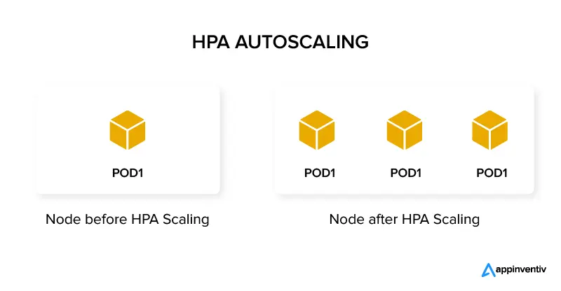

# 📌 Kubernetes HPA (Horizontal Pod Autoscaler) - Notes App

This setup deploys a simple **Notes App** in Kubernetes and demonstrates how to use a **Horizontal Pod Autoscaler (HPA)** to automatically scale pods based on CPU usage.

---

## 📂 Files in this Project

### 1️⃣ `namespaces.yaml`
```yaml
kind: Namespace
apiVersion: v1
metadata:
  name: notes-app
```
Creates a **namespace** called `notes-app` to isolate our application resources.

---

### 2️⃣ `deployment.yaml`
```yaml
kind: Deployment
apiVersion: apps/v1
metadata:
  name: notes-app-deployment
  namespace: notes-app
spec:
  replicas: 1
  selector:
    matchLabels:
      app: notes-app-pod
  template:
    metadata:
      name: notes-app
      labels:
        app: notes-app-pod
    spec:
      containers:
        - name: app
          image: trainwithshubham/notes-app-k8s
          ports:
            - containerPort: 8000
          resources:
            requests:
              cpu: 100m
              memory: 128Mi
            limits:
              cpu: 200m
              memory: 256Mi
```

**Key Points:**
- **replicas:** Starts with **1 pod**.
- **requests:** Minimum resources the pod will get.
  - `cpu: 100m` → 0.1 CPU core
  - `memory: 128Mi` → 128MB RAM
- **limits:** Maximum resources the pod can use.
  - `cpu: 200m` → 0.2 CPU core
  - `memory: 256Mi` → 256MB RAM

⚡ **Why Requests & Limits are Important:**  
The HPA uses the **CPU request** value to calculate utilization percentage.  
Example:  
If request is `100m` and pod uses `50m` → CPU utilization is **50%**.

---

### 3️⃣ `hpa.yaml`
```yaml
kind: HorizontalPodAutoscaler
apiVersion: autoscaling/v2
metadata:
  name: notes-app-hpa
  namespace: notes-app
spec:
  scaleTargetRef:
    kind: Deployment
    name: notes-app-deployment
    apiVersion: apps/v1
  minReplicas: 1
  maxReplicas: 5
  metrics:
    - type: Resource
      resource:
        name: cpu
        target:
          type: Utilization
          averageUtilization: 5
```

**Key Points:**
- **minReplicas:** Minimum number of pods (`1`)
- **maxReplicas:** Maximum number of pods (`5`)
- **averageUtilization:** Target CPU utilization percentage (based on CPU requests).  
  In this case: **5%** → Very low target for demonstration purposes.

---

## 🔄 How HPA Works
1. Kubernetes **monitors CPU usage** of pods.
2. If CPU usage **exceeds target**, HPA increases pods.
3. If CPU usage **drops**, HPA reduces pods (not below `minReplicas`).

---


---

## 🖼 Architecture Diagram


---

## 📊 Example from Your Cluster

```bash
kubectl get pods -n notes-app
```
**Output:**
```
notes-app-deployment-...   1/1   Running   0   39m
... 5 pods total ...
```
The HPA scaled pods to **5** because target CPU (5%) was exceeded.

---

```bash
kubectl get hpa -n notes-app
```
**Output:**
```
NAME            REFERENCE                         TARGETS       MINPODS   MAXPODS   REPLICAS   AGE
notes-app-hpa   Deployment/notes-app-deployment   cpu: 15%/5%   1         5         5          39m
```
- **15%/5%** → Current CPU usage is 15%, target is 5%.
- This is why HPA scaled pods to 5.

---

```bash
kubectl top pods -n notes-app
```
**Output:**
```
NAME                                    CPU(cores)   MEMORY(bytes)
notes-app-deployment-...                15m          67Mi
```
- `15m` = 15 millicores (0.015 CPU cores).
- Memory usage ~67MB.

---

## 🚀 How to Deploy
```bash
kubectl apply -f namespaces.yaml
kubectl apply -f deployment.yaml
kubectl apply -f hpa.yaml
```

## 🧹 Cleanup
```bash
kubectl delete ns notes-app
```

---

## 📌 Conclusion
This setup shows:
- How **resource requests & limits** help the scheduler & HPA.
- How **HPA** scales pods automatically based on CPU utilization.
- How to **monitor** resource usage with `kubectl top`.
