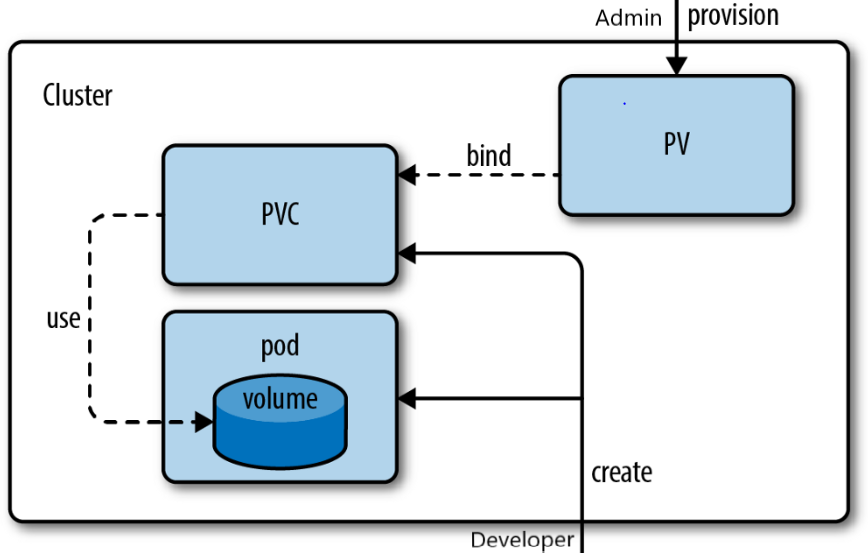

# 📘 Kubernetes Persistent Volume (PV), Persistent Volume Claim (PVC) & Deployment

---

## ✅ Why Do We Need Persistent Storage in Kubernetes?

- Kubernetes Pods are **ephemeral** → when a Pod restarts or reschedules, its data is lost.
- For **databases, file uploads, logs**, or anything that requires data retention, we need **Persistent Storage**.
- **Solution**:
  - Use **PersistentVolume (PV)** for actual storage resource.
  - Use **PersistentVolumeClaim (PVC)** for requesting storage from PV.
  - Attach PVC to Pods via Deployment so data persists even if Pod dies.

---

## ✅ Key Concepts

1. **PersistentVolume (PV)**
   - Represents a physical storage in the cluster (Node path, NFS, cloud disk, etc.).
   - Created by **Cluster Admin**.

2. **PersistentVolumeClaim (PVC)**
   - A request for storage by user/Developer.
   - Binds to a PV that satisfies its request.

3. **Deployment with PVC**
   - Pods inside Deployment use PVC to mount the storage.

---

## ✅ Flow
```
Admin creates PV → Developer creates PVC → PVC binds to PV → Pod uses PVC
```

### Diagram:


---

## ✅ Rules
- `volumeMounts.name` **must match** the name in `volumes`.
- PVC and PV must share:
  - Same **storageClassName**
  - Compatible **accessModes**
  - Enough **storage capacity**

---

## ✅ YAML Files with Full Explanation

### **1. PersistentVolume (PV)**
Represents the actual disk space inside the cluster or an external storage system.

```yaml
kind: PersistentVolume                  # Specifies PV resource
apiVersion: v1
metadata:
  name: local-pv                        # Name of the PV
  namespace: nginx                      # Namespace for logical grouping (optional)
  labels:
    app: local                          # Label for identification
spec:
  capacity:
    storage: 1Gi                        # Size of the PV
  accessModes:
    - ReadWriteOnce                     # Allows a single node to read/write
  persistentVolumeReclaimPolicy: Retain # Retain data after PVC deletion
  storageClassName: local-storage       # Matches PVC storageClassName
  hostPath:
    path: /mnt/data                     # Location on the node's filesystem
```

---

### **2. PersistentVolumeClaim (PVC)**
Requests storage from the PV.

```yaml
kind: PersistentVolumeClaim             # PVC resource
apiVersion: v1
metadata:
  name: local-pvc                       # PVC name
  namespace: nginx
spec:
  resources:
    requests:
      storage: 1Gi                      # How much storage you need
  accessModes:
    - ReadWriteOnce                     # Must match PV's access mode
  storageClassName: local-storage       # Must match PV's storageClassName
```

---

### **3. Deployment Using PVC**
Uses the PVC to mount storage inside Pods.

```yaml
kind: Deployment
apiVersion: apps/v1
metadata:
  name: local-deployment
  namespace: nginx
spec:
  replicas: 1
  selector:
    matchLabels:
      app: local-deployment-pod
  template:
    metadata:
      labels:
        app: local-deployment-pod
    spec:
      containers:
        - name: local-container
          image: nginx:latest
          ports:
            - containerPort: 80
          volumeMounts:
            - name: local-storage-mount      # MUST match the name in "volumes"
              mountPath: /var/www/html       # Path inside container
      volumes:
        - name: local-storage-mount          # Same name as in volumeMounts
          persistentVolumeClaim:
            claimName: local-pvc             # PVC name that this Pod will use
```

---

## ✅ How It Works
1. Admin provisions **PV** (static or dynamic).
2. Developer creates **PVC** → binds to matching PV.
3. Deployment uses **PVC** → mounts storage to container at `mountPath`.
4. Pod restarts? **Data is retained** because it's stored on the PV.

---

## ✅ Apply Commands

```bash
# Apply PersistentVolume
kubectl apply -f PersistentVolume.yaml

# Apply PersistentVolumeClaim
kubectl apply -f PersistentVolumeClaim.yaml

# Apply Deployment
kubectl apply -f Deployment-pv.yaml

# Verify PV and PVC
kubectl get pv
kubectl get pvc -n nginx

# Verify Pods
kubectl get pods -n nginx

# Watch Pods
kubectl get pods -n nginx -w
```

---

## ✅ Storage Verification
- PV Status: **Available → Bound**
- PVC Status: **Pending → Bound**
- Pod Status: **Running**

---

## ✅ Diagram Representation
```
+---------------------+      +---------------------+      +------------------+
|      Deployment     | ---> |        PVC          | ---> |        PV        |
| (Pod uses volumes)  |      | (Storage request)   |      | (Actual storage) |
+---------------------+      +---------------------+      +------------------+
```
