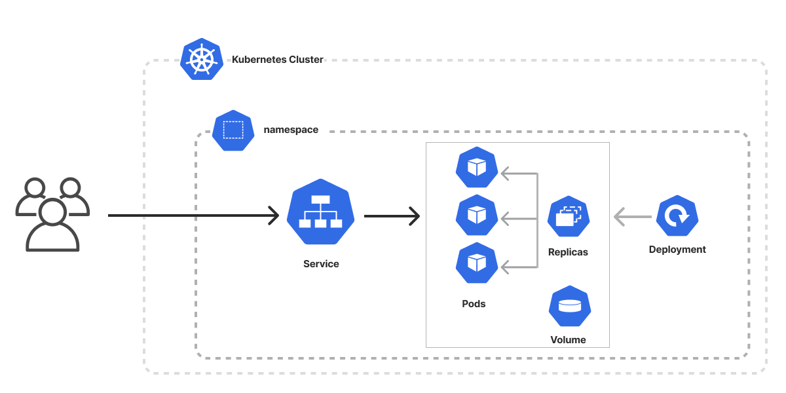

# 📘 Kubernetes Port Forwarding & Service Documentation

---

## ✅ What is Port Forwarding in Kubernetes?

Port forwarding allows you to **access an application running inside a Kubernetes Pod or Service from your local machine**, without exposing it using NodePort, LoadBalancer, or Ingress.

- It’s primarily used for **debugging** or **testing** internal applications.
- No need to modify the Service type (keeps security intact).

---

## ✅ Why Do We Need It?

- **ClusterIP Services** are only accessible inside the cluster.
- Developers often need external access for **testing applications locally** without making them public.

---

## ✅ Command Used:

```bash
sudo -E kubectl port-forward service/service -n nginx 80:80 --address=0.0.0.0
```

### ✅ Command Breakdown:

| Component                              | Meaning                                                                 |
|----------------------------------------|-------------------------------------------------------------------------|
| `sudo -E`                             | Runs as root while preserving environment variables.                   |
| `kubectl port-forward`                | Kubernetes command to forward local ports to a resource inside cluster.|
| `service/service`                     | Indicates **Service** type and its name (`service`).                  |
| `-n nginx`                            | Namespace where the service exists.                                    |
| `80:80`                               | `LocalPort:TargetPort` → Local machine’s port maps to Service port.    |
| `--address=0.0.0.0`                   | Listens on all interfaces, making it accessible externally.            |

---

### ✅ Output Example:

```
Forwarding from 0.0.0.0:80 -> 80
Handling connection for 80
```

This means:
- Your local machine’s **port 80** is mapped to Service’s **port 80**.
- Traffic now routes: **Local Machine → Kubernetes Service → Pods**.

---

## ✅ Service YAML Used:

```yaml
kind: Service
apiVersion: v1
metadata:
  name: service
  namespace: nginx
spec:
  selector:
    app: nginx              # Matches Pods with this label
  ports:
    - protocol: TCP
      port: 80              # Service's internal port
      targetPort: 80        # Pod container's port
  type: ClusterIP           # Default service type (internal only)
```

---

## ✅ How It Works:

```
Local Machine:80  --->  Service:80  --->  Pod:80
```

---

## ✅ Architecture Diagram:

### **1. Service Inside Cluster**


---

## ✅ When to Use Port Forwarding?

- When you need **temporary access** to your application.
- For **debugging internal services** without exposing them publicly.

---

## ✅ Apply Commands:

```bash
# Create Namespace (if not created)
kubectl create namespace nginx

# Apply Deployment
kubectl apply -f deployment.yaml

# Apply Service
kubectl apply -f service.yaml

# Port Forward Service
sudo -E kubectl port-forward service/service -n nginx 80:80 --address=0.0.0.0
```

---

### ✅ Notes:
- If you press **Ctrl+Z**, the process is paused. Use `fg` to resume.
- Use `&` to run in the background:
  ```bash
  sudo -E kubectl port-forward service/service -n nginx 80:80 --address=0.0.0.0 &
  ```

---

