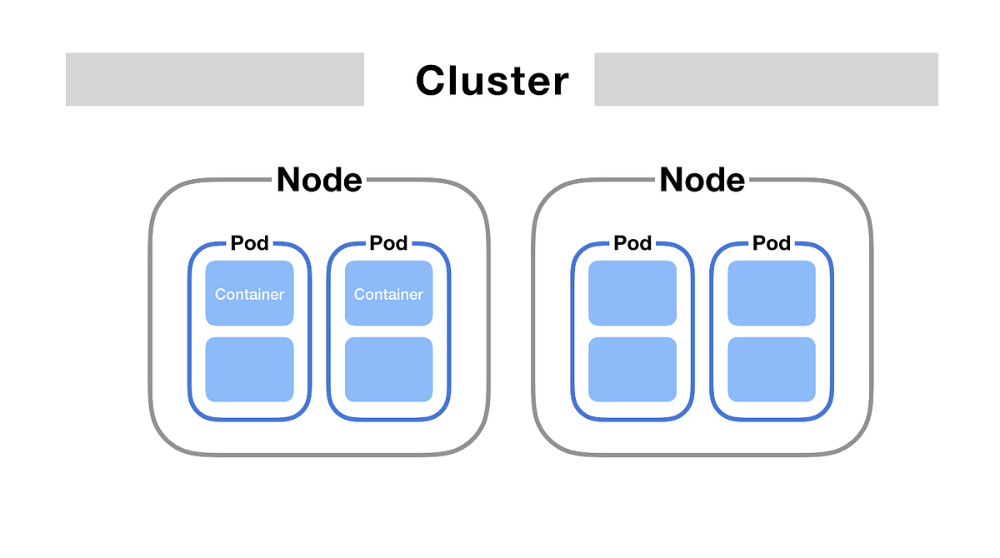

# Kubernetes Pod Management

## ✅ Overview

A **Pod** is the smallest deployable unit in Kubernetes. It represents a single instance of a running process in your cluster and usually contains one or more containers.

---

## ✅ Cluster & Namespace Check

```bash
kubectl get nodes
kubectl get ns
```

Example:

```
NAME       STATUS   ROLES           AGE    VERSION
minikube   Ready    control-plane   133d   v1.32.0
```

Namespaces:

```
NAME              STATUS   AGE
default           Active   133d
kube-node-lease   Active   133d
kube-public       Active   133d
kube-system       Active   133d
```

---

## ✅ 1. Create Namespace

If namespace does not exist:

```bash
kubectl apply -f namespaces.yaml
```

`namespaces.yaml`:

```yaml
kind: Namespace
apiVersion: v1
metadata:
  name: nginx
```

---

## ✅ 2. Create Pod

Create **`pod.yaml`**:

```yaml
kind: Pod
apiVersion: v1
metadata:
  name: nginx
  namespace: nginx
spec:
  containers:
  - name: nginx
    image: nginx
    ports:
      - containerPort: 80
```

### **Explanation of `pod.yaml`**

* **kind: Pod** → Defines that this resource is a Pod.
* **apiVersion: v1** → Uses core Kubernetes API.
* **metadata.name** → The Pod name is `nginx`.
* **metadata.namespace** → The Pod will be created in `nginx` namespace.
* **spec.containers** → Describes the containers in the Pod.

  * **name: nginx** → Container name inside the Pod.
  * **image: nginx** → Docker image to pull.
  * **ports.containerPort: 80** → Exposes port 80 inside the container (Nginx default).

**Visual Representation:**


Apply:

```bash
kubectl apply -f pod.yaml
```

---

## ✅ 3. Verify Pod

```bash
kubectl get pods -n nginx
kubectl get pods -n nginx -o wide
```

Example Output:

```
NAME    READY   STATUS    RESTARTS   AGE   IP            NODE
nginx   1/1     Running   0          28s   10.244.0.11   minikube
```

---

## ✅ 4. Access the Pod

Direct pod IP (`curl 10.244.x.x`) **won’t work from host** without port-forward or service. Instead:

### Option 1: Exec into the pod

```bash
kubectl exec -it nginx -n nginx -- bash
curl 127.0.0.1
```

You will see **Nginx default HTML page**.

### Option 2: Port Forward

```bash
kubectl port-forward pod/nginx 8080:80 -n nginx
curl localhost:8080
```

---

## ✅ 5. Describe Pod

```bash
kubectl describe pod nginx -n nginx
```

Shows:

* Container state (Running, Waiting)
* Events (Scheduled, Pulled, Started)
* IPs, Node, Ports

---

## ✅ 6. Delete Pod

```bash
kubectl delete pod nginx -n nginx
```

---

## ✅ Troubleshooting

* **Error: namespaces "nginx" not found**
  → Create namespace before applying pod.
* **Cannot curl Pod IP from host**
  → Use **port-forward** or create a **Service**.

---

## ✅ Key Commands

| Command                                   | Description  |
| ----------------------------------------- | ------------ |
| `kubectl apply -f pod.yaml`               | Create Pod   |
| `kubectl get pods -n <namespace>`         | List Pods    |
| `kubectl exec -it <pod> -- bash`          | Access Pod   |
| `kubectl port-forward pod/<pod> 8080:80`  | Forward port |
| `kubectl delete pod <pod> -n <namespace>` | Delete Pod   |

---

