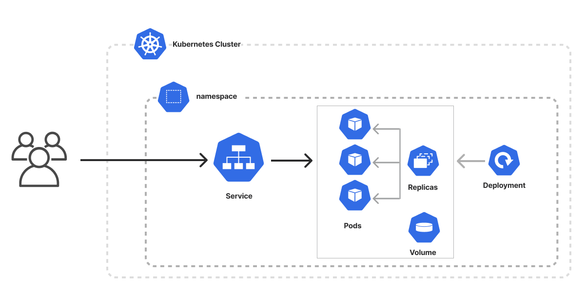

# 📘 Kubernetes Setup for Notes App

---

## ✅ Overview

This setup deploys a **Notes App** in Kubernetes using:
- **Namespace**: `notes-app`
- **Deployment**: Runs the application Pod(s)
- **Service**: Exposes the application internally via `ClusterIP`

---

### ✅ Architecture Diagram



---

## ✅ Why Namespace?

Namespaces help in organizing Kubernetes resources by grouping them logically.  
Here, we create a dedicated namespace `notes-app` to keep everything isolated.

---

### ✅ Namespace YAML

```yaml
kind: Namespace
apiVersion: v1
metadata:
  name: notes-app
```

---

## ✅ Deployment Configuration

The **Deployment** manages the Pods for the Notes App and ensures they are running as expected.

### ✅ Deployment YAML

```yaml
kind: Deployment
apiVersion: apps/v1
metadata:
  name: notes-app                  # Name of the Deployment
  namespace: notes-app             # Namespace where it will be deployed
  labels:
    app: notes                     # Deployment label (not used for Service selector)
spec:
  replicas: 1                      # Number of Pod replicas
  selector:
    matchLabels:
      app: notes-app-pod           # ✅ Must match Pod template labels
  template:                        # Pod template
    metadata:
      name: notes-pod
      labels:
        app: notes-app-pod         # ✅ Label for Pods (used by Service selector)
    spec:
      containers:
        - name: notes-app
          image: trainwithshubham/notes-app-k8s
          ports:
            - containerPort: 8000  # Container port inside the Pod
```

---

## ✅ Service Configuration

The **Service** exposes the application inside the cluster using **ClusterIP** type (default).  
It forwards traffic from `port: 8000` to the Pod's container `targetPort: 8000`.

### ✅ Service YAML

```yaml
kind: Service
apiVersion: v1
metadata:
  name: notes-app-service
  namespace: notes-app
spec:
  selector:
    app: notes-app-pod    # ✅ Must match the Pod labels (NOT Deployment labels)
  ports:
    - protocol: TCP
      port: 8000          # Service port
      targetPort: 8000    # Pod container port
  type: ClusterIP
```

---

### ❗ Why Not Use `app: notes` in Service Selector?

- The Pods have the label `app: notes-app-pod`, not `app: notes`.
- **Services route traffic to Pods, not Deployments**.
- ✅ The Service selector must exactly match the Pod labels defined in the **template section** of the Deployment.

---

## ✅ Apply Commands:

```bash
# Create Namespace
kubectl apply -f namespaces.yaml

# Create Deployment
kubectl apply -f deployment.yaml

# Create Service
kubectl apply -f service.yaml

# Check resources in the namespace
kubectl get all -n notes-app
```

---

## ✅ Test Service via Port Forwarding:

Since the Service type is `ClusterIP` (internal only), you can use **port-forward** to access it externally:

```bash
sudo -E kubectl port-forward service/notes-app-service -n notes-app 8000:8000 --address=0.0.0.0
```

- **`--address=0.0.0.0`** → Makes the service accessible from any network interface, not just localhost.
- Open in browser:  
  ```
  http://<Your-VM-IP>:8000
  ```
  or `http://localhost:8000` if running locally.

---

## ✅ Key Points:

✔ Namespace isolates resources.  
✔ Deployment creates and manages Pods.  
✔ Service connects to Pods using **matching labels**.  
✔ Service **selector must match Pod labels**, not Deployment labels.  

---

