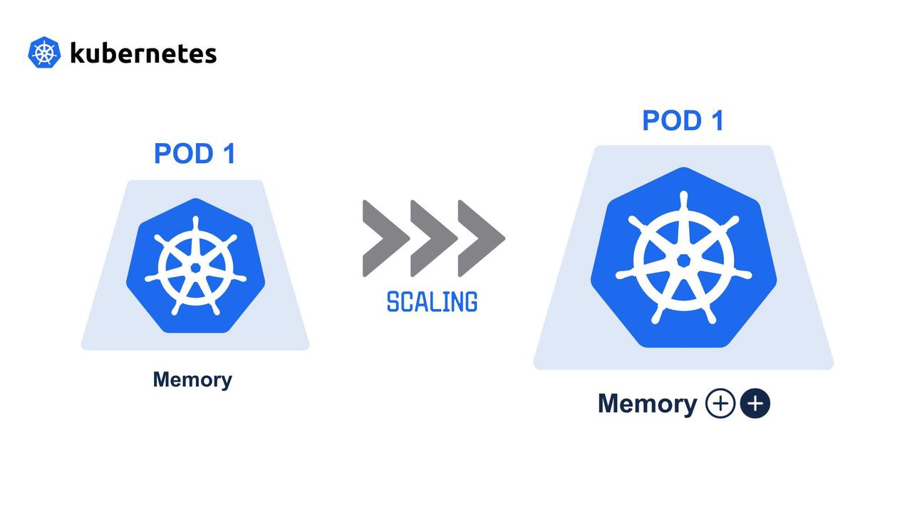

# Vertical Pod Autoscaler (VPA) - Notes App

## 📌 Introduction
Vertical Pod Autoscaler (VPA) in Kubernetes automatically adjusts the **CPU** and **memory requests/limits** for your pods based on actual usage.  
It helps ensure your applications have enough resources without wasting them.

In our case, we’ve set up VPA for the **Notes App** to automatically optimize resources.

---

## 📄 VPA YAML File
```yaml
kind: VerticalPodAutoscaler
apiVersion: autoscaling.k8s.io/v1
metadata:
  name: vpa-notes-app
  namespace: notes-app
spec:
  targetRef:
    kind: Deployment
    apiVersion: apps/v1
    name: notes-app-deployment
  updatePolicy:
    updateMode: "Auto"
```

---

## 🛠 Explanation of Each Section

### **kind & apiVersion**
- `kind: VerticalPodAutoscaler` → Specifies this is a VPA object.
- `apiVersion: autoscaling.k8s.io/v1` → API group and version for VPA.

### **metadata**
- `name: vpa-notes-app` → The name of this VPA object.
- `namespace: notes-app` → VPA is applied only within the **notes-app** namespace.

### **spec.targetRef**
- Points to the **Deployment** we want to autoscale vertically.
- `kind: Deployment` → Type of Kubernetes resource.
- `name: notes-app-deployment` → The target deployment name.
- This means VPA will monitor **all pods** created by this deployment.

### **spec.updatePolicy**
- `updateMode: "Auto"` → VPA will **automatically** update pod CPU and memory requests.
- Other options:
  - `"Off"` → VPA only gives recommendations, does not change anything.
  - `"Initial"` → Sets recommended values only when pods are created.

---

## 📊 How It Works in Our Case

### 1️⃣ Current Pod Usage
```bash
kubectl top pods -n notes-app
```
Example output:
```
NAME                                    CPU(cores)   MEMORY(bytes)
notes-app-deployment-7545984d74-vzrwl   13m          103Mi
```
- **13m** → 13 millicores of CPU usage (~1.3% of a single CPU core).
- **103Mi** → 103 MiB of memory in use.

---

### 2️⃣ VPA Recommendations
```bash
kubectl get vpa -n notes-app
```
Example output:
```
NAME            MODE   CPU   MEM       PROVIDED   AGE
vpa-notes-app   Auto   25m   262144k   True       80m
```
- **CPU: 25m** → VPA recommends 25 millicores (higher than 13m to allow for spikes).
- **MEM: 262144k** (~256Mi) → Memory recommendation based on past usage.

---

### 3️⃣ Automatic Adjustments
- Since we use `"Auto"` mode, VPA **updates resource requests/limits automatically** in the pod spec.
- When the load changes, VPA updates resources so pods restart with new values.

---

## ⚠ Limitations of VPA
1. **Pod Restarts**
   - When resources are updated, pods are restarted to apply the new values.
2. **Cannot Scale Down Below Requests**
   - VPA won’t shrink resources below safe operational limits.
3. **Not a Replacement for HPA**
   - VPA changes *vertical* resource allocation, while HPA adds/removes pods (*horizontal* scaling).
4. **May Conflict with HPA on CPU**
   - If both VPA and HPA manage CPU, you must use a **recommendation-only mode** for one of them.

---

## 🖼 Architecture Diagram


---

## 🧾 Commands Recap
```bash
# Apply VPA
kubectl apply -f vpa.yaml

# View VPA recommendations
kubectl get vpa -n notes-app

# View pod usage
kubectl top pods -n notes-app
```

---

## ✅ Summary
- **VPA** is great for applications with unpredictable or changing resource needs.
- In **Auto** mode, it keeps your pods well-resourced without manual tuning.
- Combine with **HPA** for full vertical + horizontal scaling power.
